# Calculator App
---

Calculator app where you can do simple calculations, view a log of your previous calculations and change the theme / font.

---
## Pages:
### Calculator
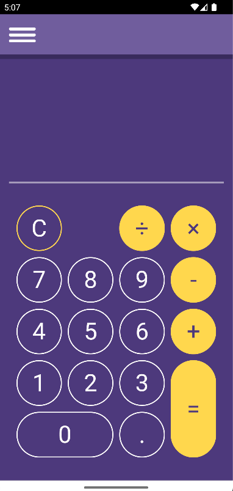
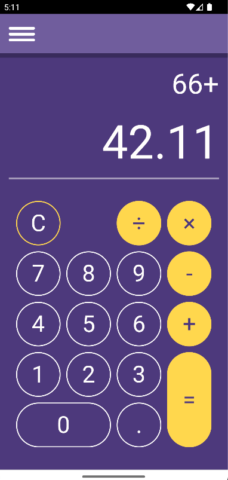
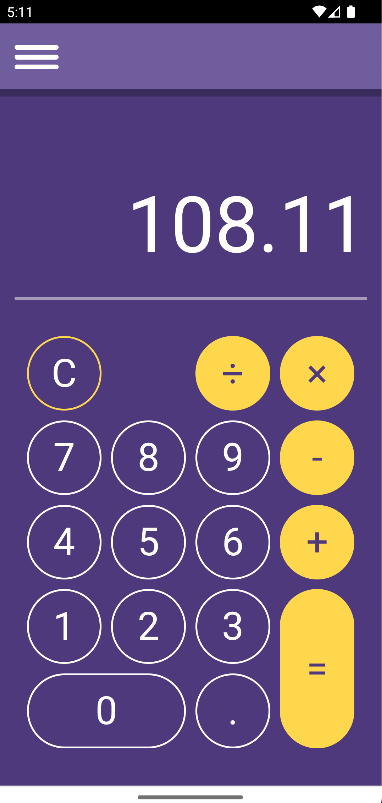
### History
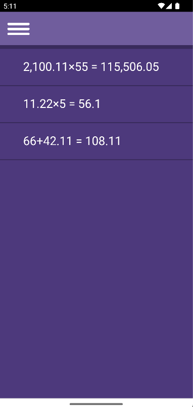
### Settings
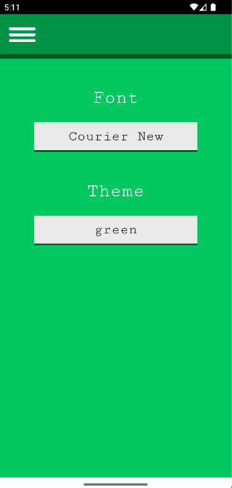
### Open Menu
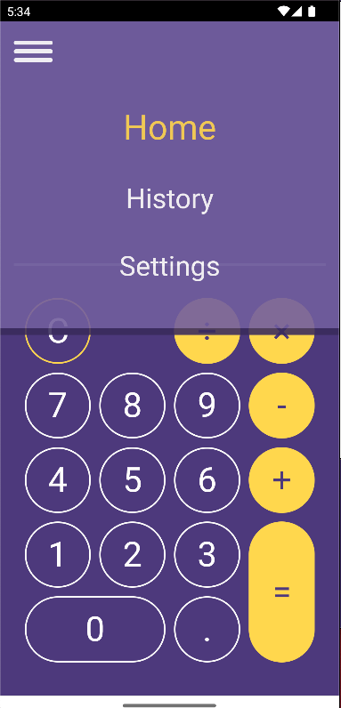

### Calculator page with different font.
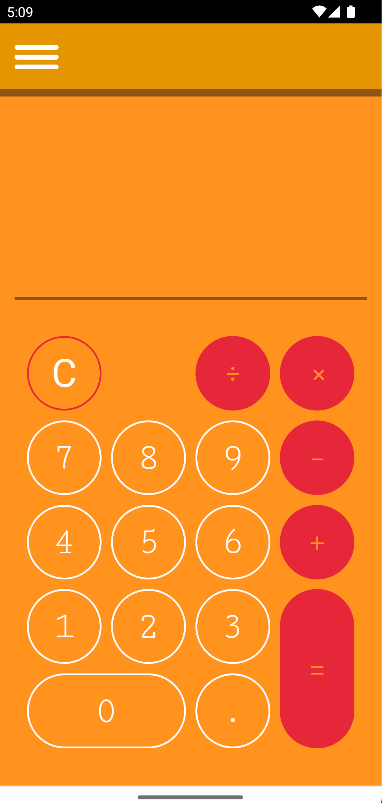

### Landscape view
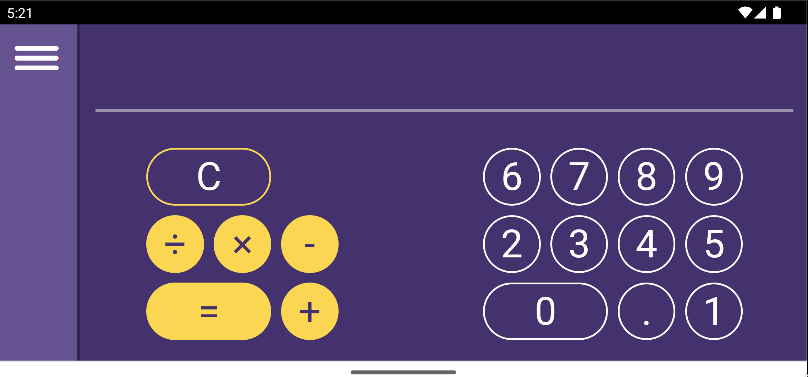

### Desktop view
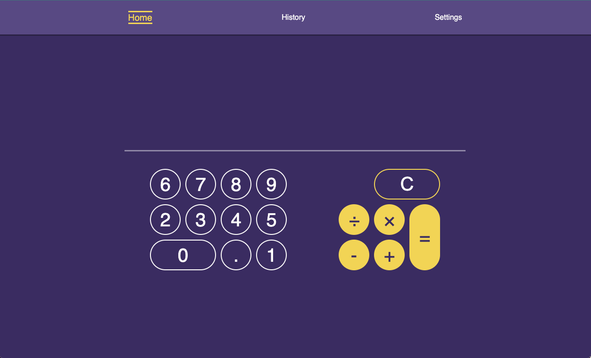
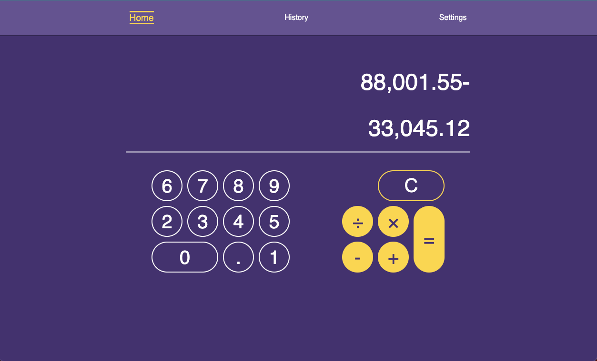
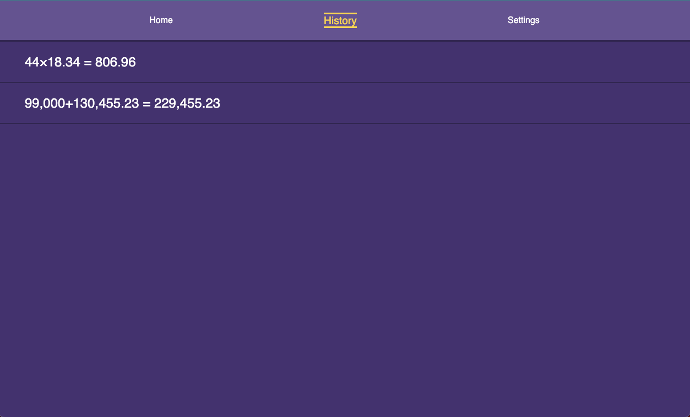
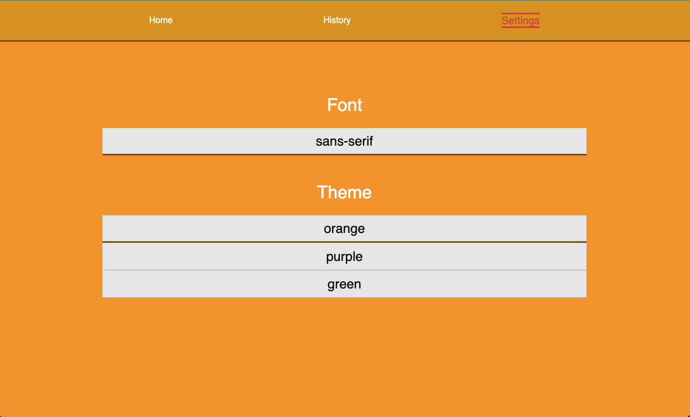

---
### Technologies:
- React.js
- TypeScript
- JavaScript